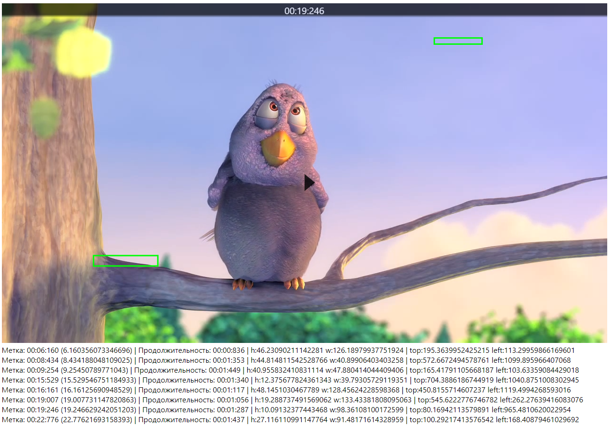

# Video events test task

Тестовое задание.

Отображено видео с возможностью постановки на паузу и возобновлением воспроизведения по клику на область видео.
Реализован список событий аналитики с возможностью позиционирования видео на момент, указанный в событии.
Список событий аналитики получается запросом со стороннего ресурса.

В момент возникновения события в плеере поверх видео отрисовывается зелёный прямоугольник, соответствующий области, 
определенной в событии. Прямоугольник отображается как при переходе к событию по клику из списка событий, 
так и в случае обычного воспроизведения видео. При наступлении даты окончания события прямоугольник скрывается.

Ссылка на прод: https://video-events-test-ask.vercel.app/

Стек: TypeScript, ReactJS, Redux, Thunk, Redux-Toolkit, HTML, CSS

# Скриншоты

